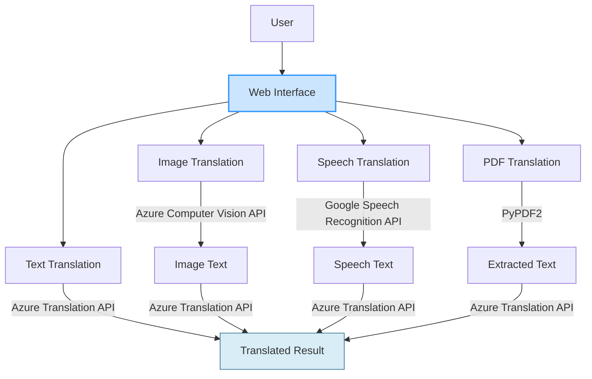

# [TranslationWeb](https://aitranslation.azurewebsites.net)

使用Flask框架

### 下載所需的套件
```pip install -r requirements.txt```
### 執行app.py
```python app.py```
### 用sample體驗功能
1. 語音翻譯:  sample.wav\
  輸入語言: Chinese(Traditional)
2. PDF文件翻譯: sample.pdf\
  輸入語言: English
3. 圖片翻譯:  test_image.png\
  輸入語言: English

### 系統架構圖

